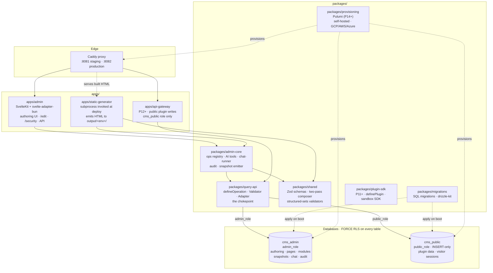
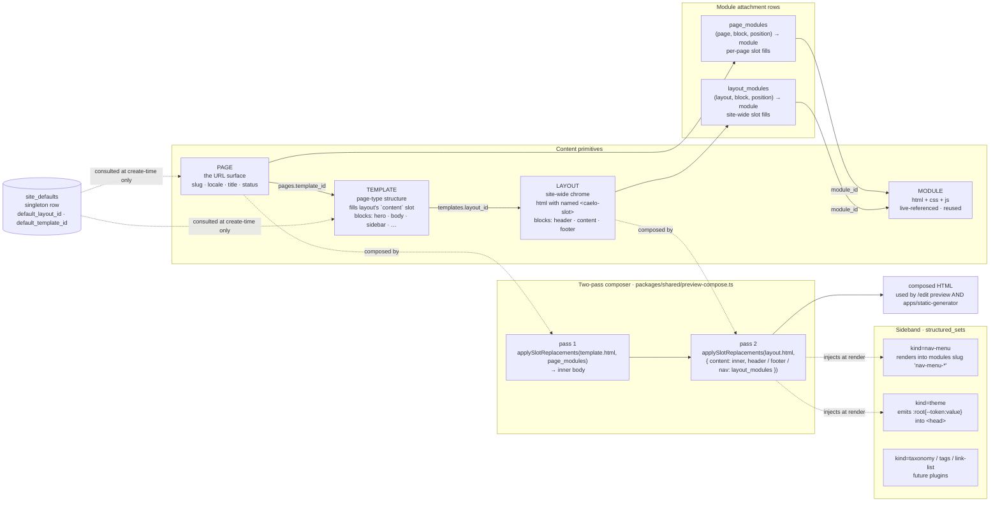
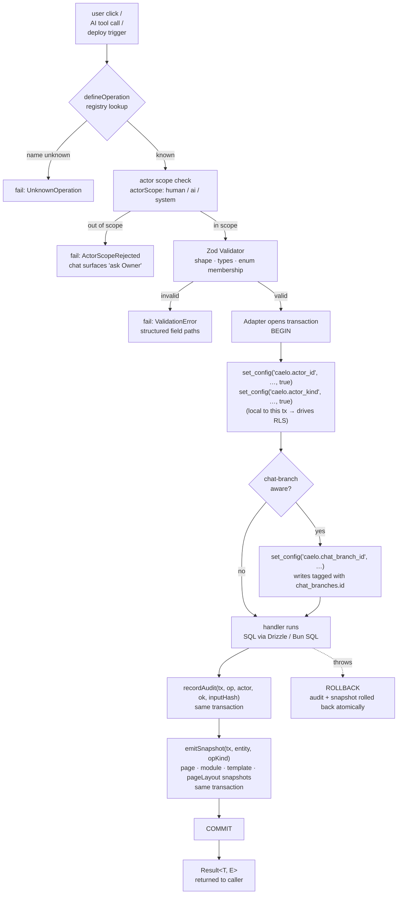
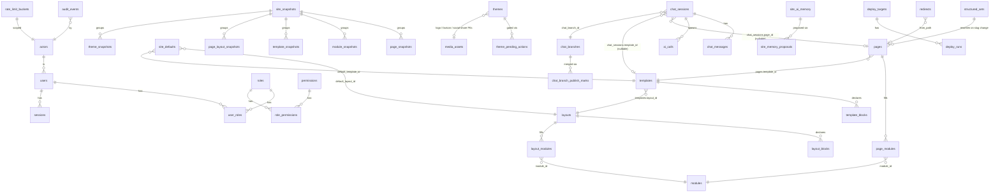

# Architecture

This is the deep-dive companion to [`CLAUDE.md`](./CLAUDE.md). CLAUDE.md is the engineering-rules file (read first, kept short). This file answers *"how does Caelo fit together?"* — broken into four focused diagrams plus a guide to where things live in the repo.

For the *why* behind every choice (RLS, two databases, snapshots, no-fallbacks, etc.) see [`CMS_REQUIREMENTS.md`](./CMS_REQUIREMENTS.md).

---

## 1. System overview — what runs where

**Key invariants** (see [CLAUDE.md §2](./CLAUDE.md#2-non-negotiable-invariants)):

- `admin_role` and `public_role` are isolated. The API Gateway never holds `admin_role` credentials.
- RLS is `FORCE`d on every table in both databases — role isolation alone is not enough.
- The static generator runs as a subprocess at deploy time. It is not a long-running service.

---

## 2. Content composition — how a page becomes HTML

Four primitives wired top-down. A **layout** owns site-wide chrome; a **template** defines a page-type's blocks; a **page** binds to one template and references modules; **modules** are the leaf content units. Composition is two-pass: template fills first, then the layout wraps it.

**No-fallback rule** (see [CLAUDE.md §2](./CLAUDE.md#2-non-negotiable-invariants)): missing layout `content` slot, missing structured set referenced by name, missing template/layout where required → `ComposeError` / structured `HandlerError`. Never silent recovery. `site_defaults` is a *create-time* resolver, NOT a render-time fallback.

**Three "add module" paths, picked by intent:**

| user says… | tool | blast radius |
|---|---|---|
| "add a CTA on this page" | `add_module_to_page` | one page |
| "add a hero on every blog post" | `add_module_to_template` | all pages on the template |
| "add a footer on every page" | `add_module_to_layout` | all pages on the layout |
| "move the hero to the header" | `move_module` | same page, cross-block |
| "show testimonials before gallery" | `reorder_module` | same page, same block |
| "duplicate this page" | `duplicate_page` | modules carry by reference |
| "switch this page to landing-tpl" | `change_template` | modules migrate; orphan disposition required |
| "edit the menu" | `set_nav_menu` | `structured_sets` kind=nav-menu |
| "make the primary brighter" | `update_theme` | `structured_sets` kind=theme |

Mutations on layouts and site_defaults are Owner-only (`actorScope: ["human","system"]`); AI calls return `ActorScopeRejected` and the chat surfaces a permission message instead of retrying.

---

## 3. Write path — from user click to Postgres row

Every mutation — form action, AI tool call, deploy trigger — traverses the same chain. The Validator is the chokepoint; the adapter binds the actor identity to the transaction so RLS policies see the right scope.

**Branch-aware writes.** Each chat session owns an ephemeral `chat_branches` row. Snapshots emitted from a chat are tagged with that `chat_branch_id`. The branch only merges into main on publish (`publishChatSessionOp`). This is why two editors in two chats can edit the same page without colliding.

**Static-generator parity.** Both the admin's `/edit` preview AND `apps/static-generator` (deploy) call `composePageWithLayout` from `packages/shared/preview-compose.ts`. Same input → byte-identical output. There is no separate "production renderer".

---

## 4. Data model — what's in `cms_admin`

Foreign keys are shown only where they cross domain boundaries. Every box has FORCE RLS.

**Domain boundaries.**

| Domain | Tables (representative) | Notes |
|---|---|---|
| **Auth** | `users`, `sessions`, `actors`, `roles`, `permissions`, `user_roles`, `role_permissions` | Argon2id passwords. Sessions hold a CSRF token consumed by every form action. |
| **Content** | `layouts`, `layout_blocks`, `layout_modules`, `templates`, `template_blocks`, `pages`, `page_modules`, `modules` | Two-pass composer: layout wraps template; both have block/module attachment rows. |
| **Snapshots** | `site_snapshots`, `page_snapshots`, `module_snapshots`, `template_snapshots`, `page_layout_snapshots`, `chat_branch_publish_marks` | Every write emits a snapshot. Reverting `site_snapshots` restores the full set atomically. |
| **Chat** | `chat_sessions`, `chat_branches`, `chat_messages`, `ai_calls`, `site_ai_memory`, `site_memory_proposals` | Sessions on ephemeral branches. AI memory proposals queue for Owner review. |
| **Deploy** | `deploy_targets`, `deploy_runs` | `deploy_runs.progress jsonb` updated by the static generator subprocess. |
| **Sideband** | `structured_sets`, `redirects`, `site_defaults`, `audit_events`, `rate_limit_buckets`, `user_preferences` | `structured_sets` is the typed-list primitive (nav-menus, taxonomies, tags, link-lists, language-selectors). `site_defaults` is a singleton row. |
| **Themes** (v0.11.0, #45) | `themes`, `theme_snapshots`, `theme_pending_actions` | DTCG-shaped jsonb `tokens` (color / dimension / typography composite / shadow composite / motion / breakpoint, plus DTCG aliasing). Exactly one `is_active=true` row enforced by partial unique index. Four media FKs for logo / logo-dark / favicon / social-share. Create / activate / delete go through the §11.A propose/execute gate (`theme_pending_actions`). The renderer reads the active theme via `ComposeInput.theme` and emits Tailwind 4-namespaced CSS vars under `<style data-source="theme">`. Zod source of truth: `packages/shared/src/themes.ts`. |

**Snapshot semantics.** A snapshot is a content-addressed copy of an entity at a point in time, grouped under a `site_snapshots` row tagged with the originating chat branch (or `NULL` for system / direct-admin writes). Reverting walks the group and restores every member in one transaction. Chat-keyed Undo (the primary history surface) targets the most recent `site_snapshots` row tagged with the active branch.

---

## Repo guide — where things live

| Path | What lives here |
|---|---|
| `apps/admin/` | SvelteKit admin app + every authenticated route (`/edit`, `/content/*`, `/security/*`). |
| `apps/static-generator/` | Subprocess invoked by `deploy.trigger`; reads composed pages + emits HTML to `output/<env>/`. |
| `apps/api-gateway/` | Reserved for P12+ — public plugin write endpoints under the `cms_public` role. |
| `packages/admin-core/` | Ops registry + AI tool dispatch + chat-runner + audit + snapshot emitter. The orchestrator. |
| `packages/query-api/` | `defineOperation`, the Validator, the Database Adapter. Every DB call goes through here. |
| `packages/shared/` | Zod schemas, the two-pass composer, the slot scanner, structured-sets validators. Shared between admin and static-gen. |
| `packages/migrations/` | SQL migrations for both `cms_admin` and `cms_public`; applied in order at boot. |
| `packages/plugin-sdk/` | P11+ — `definePlugin`, `defineComponent`, the Deno-sandbox SDK injected into plugin code. |
| `packages/provisioning/` | P14+ — Pulumi for self-hosted Compose, GCP, AWS, Azure adapters. |

---

*This document is hand-edited. A future `apps/admin/scripts/generate-architecture-doc.ts` could regenerate the diagrams from the ops registry + migration files; see the deferred items in the master plan.*
